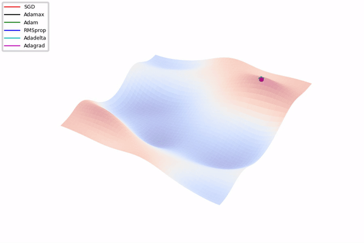

# Optimizer Visualization

-----

Visualize gradient descent optimization algorithm in Pytorch.

## Example

I created an **artificial landscape** for testing purpose

## References:
* https://github.com/Jaewan-Yun/optimizer-visualization
* https://ruder.io/optimizing-gradient-descent/
* http://louistiao.me/notes/visualizing-and-animating-optimization-algorithms-with-matplotlib/
* https://en.wikipedia.org/wiki/Test_functions_for_optimization

## TODO:
- [ ] Add note for the README
- [ ] Update the 2D animation plot
- [ ] Problem with Saddle points during optimization 